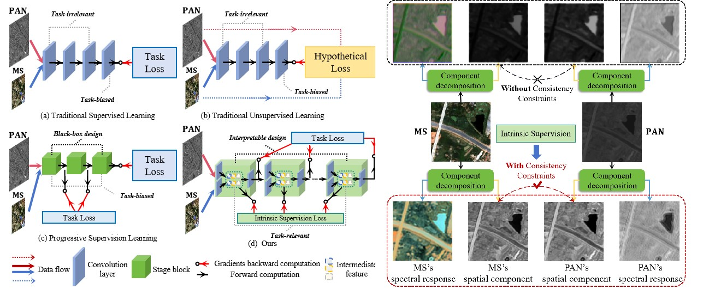
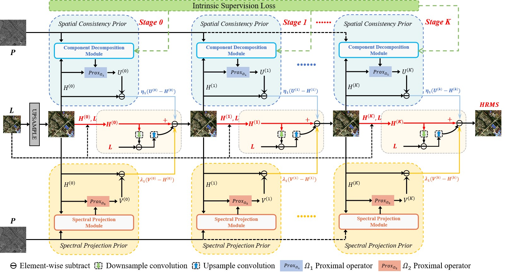

# DISPNet

# Implement of DISPNet

Code for Deep Unfolded Network with Intrinsic Supervision for Pan-sharpening


###### Configuration requirements before development

1. Python  3.7.0
2. Pytorch 1.12.1

### File directory description
```
DISPNet-main
├── data
│  ├── TestFolder
|  |  |── ms
│  │     |└── 1.tif
|  |  |── ms_label
│  │     |└── 1.tif
|  |  |── pan
│  │     |└── 1.tif
|  |  |── pan_label
│  │     |└── 1.tif
├── checkpoint
│  ├── net
│  │     |└── Best.pth
│  ├── opt
├── LICENSE.txt
├── README.md
├── config.py
├── dataset.py
├── eval.py
├── modal.py
├── model.py
├── modules.py
├── perstages.py
├── process.py
├── synthesis.py
├── test.py
├── train.py
```

### Contributor

Baixuzx7 @ wanghebaixu@gmail.com

### Copyright statement

The project is signed under the MIT license, see the [LICENSE.txt](https://github.com/Baixuzx7/DISPNet/main/LICENSE.txt)

### Architecture of DISPNet



### Reference
```
@inproceedings{wang2024deep,
  title={Deep Unfolded Network with Intrinsic Supervision for Pan-Sharpening},
  author={Wang, Hebaixu and Gong, Meiqi and Mei, Xiaoguang and Zhang, Hao and Ma, Jiayi},
  booktitle={Proceedings of the AAAI Conference on Artificial Intelligence},
  volume={38},
  number={6},
  pages={5419--5426},
  year={2024}
}
```
